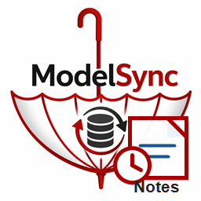

# ModelSync


[](https://www.nuget.org/packages/UmbrellaFrame.ModelSync.Core)
[](https://github.com/UmbrellaFrameHQ/modelsync/actions)
[](LICENSE)
[](https://learn.microsoft.com/dotnet/standard/net-standard)
[](https://hits.sh/github.com/UmbrellaFrameHQ/modelsync/)

**Language / Dil:** [English](#english) - [Turkce](#turkce)

---

## English

**Attribute-based SQL schema generator for .NET**  
Zero ORM dependency - 4 database providers - explicit destructive-operation safety.

ModelSync lets you decorate plain C# classes with attributes and generate or execute SQL DDL for `CREATE TABLE`, `ALTER TABLE`, `DROP TABLE`, `TRUNCATE TABLE`, and `CREATE INDEX` without Entity Framework or a heavy ORM.

```text
UmbrellaFrame.ModelSync.Core          -> Attributes, interfaces, SQL builder
UmbrellaFrame.ModelSync.SqlServer     -> SQL Server / Azure SQL provider
UmbrellaFrame.ModelSync.MySql         -> MySQL / MariaDB provider
UmbrellaFrame.ModelSync.PostgreSQL    -> PostgreSQL provider
UmbrellaFrame.ModelSync.SQLite        -> SQLite provider
UmbrellaFrame.ModelSync.Analyzers     -> Roslyn compile-time checks
UmbrellaFrame.ModelSync.NotesExtension -> Optional Visual Studio Notes service layer
UmbrellaFrame.ModelSync.NotesExtension.Vsix -> Optional Visual Studio editor extension
```

### Design Philosophy

ModelSync v1 intentionally favors **explicit, developer-controlled schema operations** over automatic live-database mutation.

Schema changes can be destructive. Dropping columns, changing column types, truncating tables, or dropping tables can cause data loss if applied automatically. For that reason, ModelSync v1 generates SQL and provides explicit DDL methods, but it does not silently synchronize a live database.

Planned Phase 2 direction:

- compare model attributes with the live database schema
- generate an ALTER TABLE plan before applying it
- support dry-run SQL output
- classify risky and destructive operations
- require explicit opt-in before data-loss operations

### Installation

Install only the provider you need:

```bash
dotnet add package UmbrellaFrame.ModelSync.SqlServer
dotnet add package UmbrellaFrame.ModelSync.MySql
dotnet add package UmbrellaFrame.ModelSync.PostgreSQL
dotnet add package UmbrellaFrame.ModelSync.SQLite
```

Each provider package pulls `UmbrellaFrame.ModelSync.Core` as a dependency.

Optionally add the analyzer package:

```bash
dotnet add package UmbrellaFrame.ModelSync.Analyzers
```

### Downloads and Tutorials

| Resource | Link |
|---|---|
| GitHub repository | [UmbrellaFrameHQ/modelsync](https://github.com/UmbrellaFrameHQ/modelsync) |
| Latest source download | [Download ZIP](https://github.com/UmbrellaFrameHQ/modelsync/archive/refs/heads/main.zip) |
| Releases | [GitHub Releases](https://github.com/UmbrellaFrameHQ/modelsync/releases) |
| Quick start tutorial | [docs/02-quickstart.md](docs/02-quickstart.md) |
| Provider tutorials | [docs/04-providers.md](docs/04-providers.md) |
| Examples | [examples/README.md](examples/README.md) |
| NuGet README source | [docs/nuget/README.md](docs/nuget/README.md) |

### Quick Start

```csharp
using UmbrellaFrame.ModelSync.Core;
using UmbrellaFrame.ModelSync.MySql;

[MySqlTableName("products")]
public class Product
{
    [MySqlColumnType(MySqlColumnType.INT)]
    [MySqlColumnPrimaryKey(isAutoIncrement: true)]
    public int Id { get; set; }

    [MySqlColumnType(MySqlColumnType.VARCHAR, "255")]
    [MySqlColumnNotNull]
    public string Name { get; set; }

    [MySqlColumnType(MySqlColumnType.DECIMAL, "10,2")]
    [DbColumnDefault("0.00")]
    [DbColumnCheck("Price >= 0")]
    public decimal Price { get; set; }
}

var generator = new MySqlTableGenerator(
    "Server=localhost;Database=mydb;User=root;Password=pass;"
);

generator.CreateDatabase();
generator.GenerateMySqlTable<Product>(ifNotExists: true);
await generator.CreateTablesAsync(cancellationToken);
```

Generated SQL:

```sql
CREATE TABLE IF NOT EXISTS `products` (
    `Id` INT PRIMARY KEY AUTO_INCREMENT,
    `Name` VARCHAR(255) NOT NULL,
    `Price` DECIMAL(10,2) DEFAULT 0.00 CHECK (Price >= 0)
);
```

### Complete Example with Index and Default

```csharp
using UmbrellaFrame.ModelSync.Core;
using UmbrellaFrame.ModelSync.PostgreSQL;

[PostgresTableName("customers")]
public sealed class CustomerModel
{
    [PostgresColumnType(PostgresColumnType.INTEGER)]
    [PostgresColumnPrimaryKey]
    public int Id { get; set; }

    [PostgresColumnType(PostgresColumnType.VARCHAR, "160")]
    [PostgresColumnNotNull]
    [DbColumnIndex("idx_customers_email", isUnique: true)]
    public string Email { get; set; } = string.Empty;

    [PostgresColumnType(PostgresColumnType.TIMESTAMP)]
    [DbColumnDefault("CURRENT_TIMESTAMP")]
    public DateTime CreatedAt { get; set; }
}

var generator = new PostgresTableGenerator(
    "Host=localhost;Database=appdb;Username=postgres;Password=pass;");

var tableSql = generator.GeneratePostgresTable<CustomerModel>(ifNotExists: true);
var indexes = generator.GenerateIndexSql<CustomerModel>();

Console.WriteLine(tableSql);
foreach (var indexSql in indexes)
{
    Console.WriteLine(indexSql);
}
```

This prints both table DDL and index DDL before anything is executed.

### ALTER TABLE Operations

Safe additive operations can run directly:

```csharp
generator.AddColumn<Product>("Stock");
await generator.AddColumnAsync<Product>("Stock", cancellationToken);
```

Destructive or risky operations require explicit opt-in:

```csharp
var allow = DestructiveOperationOptions.Allow();

generator.DropColumn<Product>("LegacyCode", allow);
generator.AlterColumnType<Product>("Price", allow);
generator.DropTables(allow);

await generator.DropColumnAsync<Product>("LegacyCode", allow, cancellationToken);
await generator.AlterColumnTypeAsync<Product>("Price", allow, cancellationToken);
await generator.DropTablesAsync(allow, cancellationToken);
```

Calling `DropColumn`, `AlterColumnType`, or `DropTables` without `DestructiveOperationOptions.Allow()` throws an exception by design.

SQLite does not support `ALTER COLUMN TYPE` directly. Even with destructive permission, SQLite throws `NotSupportedException`; use a create-copy-drop table rebuild strategy instead.

### Identifier Safety

ModelSync uses strict identifier validation before quoting table, column, index, and database names.

Allowed identifier pattern:

```text
^[A-Za-z_][A-Za-z0-9_]*$
```

This intentionally rejects spaces, dots, quotes, brackets, semicolons, hyphens, and other characters that make generated DDL harder to reason about safely.

### Supported Attributes

Provider-specific attributes:

| Attribute | Description |
|---|---|
| `[{Db}TableName("name")]` | Set table name |
| `[{Db}ColumnType(Type)]` | Set column data type |
| `[{Db}ColumnPrimaryKey]` | Mark as primary key |
| `[{Db}ColumnNotNull]` | Add NOT NULL |
| `[{Db}ColumnUnique]` | Add UNIQUE |
| `[{Db}ForeignKey("column","table","ref")]` | Add foreign key |

Cross-provider attributes:

| Attribute | Description |
|---|---|
| `[DbColumnDefault("expr")]` | Add DEFAULT expression |
| `[DbColumnCheck("expr")]` | Add CHECK expression |
| `[DbColumnIndex]` | Generate CREATE INDEX SQL via `GenerateIndexSql<T>()` |

### Roslyn Analyzer

| Rule | Severity | Description |
|---|---|---|
| MSYNC001 | Warning | Public property is missing a column type attribute |
| MSYNC002 | Warning | Class has column attributes but no table name attribute |
| MSYNC003 | Warning | Model table has no primary key defined |

```ini
dotnet_diagnostic.MSYNC001.severity = error
dotnet_diagnostic.MSYNC003.severity = none
```

### ModelSync Notes for Visual Studio

ModelSync Notes is an optional VSIX, not part of the core runtime package. It adds a small notes/history glyph next to model classes and model properties in Visual Studio. Each entry stores the author, date, and note text.



There are two visual elements:

- Extension icon: `modelsync-notes.png`, shown by Visual Studio in the Extensions window.
- Editor glyph: the small clickable history button rendered next to model classes and properties.

Notes are stored as solution-local JSON:

```text
<solution>\.modelsync\notes.json
```

The extension is designed for developer workflow notes, not as a secure audit log. The UI and service allow only the note owner to edit or delete a note, but a local JSON file can still be edited by anyone with filesystem access.

Example Notes JSON:

```json
{
  "schemaVersion": 1,
  "notes": {
    "ProductModel.Name": [
      {
        "id": "note_4b2e...",
        "createdAt": "2026-05-20T10:35:00+00:00",
        "createdBy": {
          "id": "kursat@example.com",
          "name": "Kursat Solmaz",
          "source": "visualstudio-git"
        },
        "text": "Keep VARCHAR(255); external catalog rejects longer names."
      }
    ]
  }
}
```

Build the VSIX on Windows:

```powershell
dotnet build .\UmbrellaFrame.ModelSync.NotesExtension.Vsix\UmbrellaFrame.ModelSync.NotesExtension.Vsix.csproj -c Release
```

Install:

```text
UmbrellaFrame.ModelSync.NotesExtension.Vsix\bin\Release\net472\UmbrellaFrame.ModelSync.NotesExtension.Vsix.vsix
```

The VSIX package includes its own icon file:

```text
UmbrellaFrame.ModelSync.NotesExtension.Vsix\modelsync-notes.png
```

The default model detector shows notes only for classes ending with `Model`. You can customize this per solution:

```json
{
  "modelClassSuffixes": [ "Model", "Entity" ],
  "modelClassNames": [ "Product" ]
}
```

Save that file as:

```text
<solution>\.modelsync\notes-settings.json
```

### Development

Run unit tests without external databases:

```powershell
.\scripts\test.ps1
```

Run all solution build steps on Windows:

```powershell
.\scripts\build.ps1
```

Package NuGet artifacts and the Notes VSIX:

```powershell
.\scripts\pack.ps1
```

If your local PowerShell policy blocks scripts:

```powershell
powershell -NoProfile -ExecutionPolicy Bypass -File .\scripts\pack.ps1
```

Publish NuGet packages after setting `NUGET_API_KEY`:

```powershell
.\scripts\publish-nuget.ps1
```

Integration tests are opt-in because they require live databases. Set the relevant flag and connection string before running `.\scripts\test.ps1 -Integration`:

```powershell
$env:MODELSYNC_RUN_MYSQL_INTEGRATION = "1"
$env:MODELSYNC_MYSQL_CONNECTION_STRING = "Server=localhost;Port=3306;Database=appdb;User ID=root;Password=rootpass;"
```

Note: integration tests are intentionally opt-in. A fresh clone can run unit tests without installing MySQL, PostgreSQL, SQL Server, or MariaDB.

### Documentation

| Document | Description |
|---|---|
| [Overview](docs/01-overview.md) | Architecture and design decisions |
| [Quick Start](docs/02-quickstart.md) | Working examples per provider |
| [Attribute Reference](docs/03-attributes.md) | Attribute list and parameter details |
| [Provider Guides](docs/04-providers.md) | Provider-specific behavior |
| [API Reference](docs/05-api-reference.md) | Public API details |
| [Dependency Injection](docs/06-dependency-injection.md) | ASP.NET Core DI usage |
| [Roslyn Analyzers](docs/07-analyzers.md) | Analyzer rules |
| [Architecture](docs/08-architecture.md) | Internal flow and extension points |
| [Contributing](docs/09-contributing.md) | Development setup |
| [Changelog](docs/10-changelog.md) | Version history |
| [Notes Extension](docs/11-notes-extension.md) | Optional Visual Studio notes/history extension |

### Articles and Examples

| Resource | Description |
|---|---|
| [Articles](articles/README.md) | Three short publish-ready articles for introducing ModelSync |
| [Examples](examples/README.md) | MySQL, SQL Server, SQLite, and destructive-operation examples |

### Why ModelSync?

| Feature | ModelSync | EF Core | FluentMigrator | DbUp |
|---|:---:|:---:|:---:|:---:|
| Zero ORM dependency | Yes | No | Yes | Yes |
| Attribute-based schema | Yes | Yes | No | No |
| Provider packages | Yes | Yes | Yes | Yes |
| Async DDL execution | Yes | Yes | Limited | Yes |
| Analyzer support | Yes | No | No | No |
| Explicit destructive safety | Yes | Partial | Manual | Manual |
| Automatic live DB diff | Planned | Yes | No | No |

### License

MIT (c) UmbrellaFrame

---

## Turkce

**.NET icin attribute tabanli SQL sema uretici**  
Sifir ORM bagimliligi - 4 veritabani saglayici - yikici islemler icin acik onay guvenligi.

ModelSync, sade C# siniflarini attribute'larla isaretleyerek Entity Framework veya agir bir ORM kullanmadan `CREATE TABLE`, `ALTER TABLE`, `DROP TABLE`, `TRUNCATE TABLE` ve `CREATE INDEX` DDL'i uretmenizi veya calistirmanizi saglar.

### Tasarim Felsefesi

ModelSync v1, canli veritabanini otomatik degistirmek yerine **gelistiricinin acikca kontrol ettigi sema islemlerini** tercih eder.

Sema degisiklikleri yikici olabilir. Sutun silme, sutun tipi degistirme, tabloyu bosaltma veya tablo silme gibi islemler otomatik uygulanirsa veri kaybina neden olabilir. Bu nedenle ModelSync v1 SQL uretir ve acik DDL metotlari saglar; canli veritabanini sessizce kendi kendine senkronize etmez.

Planlanan Faz 2 yonu:

- model attribute'larini canli veritabani semasiyla karsilastirmak
- uygulamadan once ALTER TABLE plani uretmek
- dry-run SQL ciktisi vermek
- riskli ve yikici islemleri siniflandirmak
- veri kaybi olusturabilecek islemler icin acik onay istemek

### Kurulum

```bash
dotnet add package UmbrellaFrame.ModelSync.SqlServer
dotnet add package UmbrellaFrame.ModelSync.MySql
dotnet add package UmbrellaFrame.ModelSync.PostgreSQL
dotnet add package UmbrellaFrame.ModelSync.SQLite
dotnet add package UmbrellaFrame.ModelSync.Analyzers
```

Her saglayici paketi `UmbrellaFrame.ModelSync.Core` paketini bagimlilik olarak indirir.

### Hizli Baslangic

```csharp
using UmbrellaFrame.ModelSync.Core;
using UmbrellaFrame.ModelSync.MySql;

[MySqlTableName("urunler")]
public class Urun
{
    [MySqlColumnType(MySqlColumnType.INT)]
    [MySqlColumnPrimaryKey(isAutoIncrement: true)]
    public int Id { get; set; }

    [MySqlColumnType(MySqlColumnType.VARCHAR, "255")]
    [MySqlColumnNotNull]
    public string Ad { get; set; }

    [MySqlColumnType(MySqlColumnType.DECIMAL, "10,2")]
    [DbColumnDefault("0.00")]
    [DbColumnCheck("Fiyat >= 0")]
    public decimal Fiyat { get; set; }
}

var generator = new MySqlTableGenerator(
    "Server=localhost;Database=mydb;User=root;Password=pass;"
);

generator.CreateDatabase();
generator.GenerateMySqlTable<Urun>(ifNotExists: true);
await generator.CreateTablesAsync(cancellationToken);
```

### ALTER TABLE Islemleri

Guvenli ekleme islemleri dogrudan calisabilir:

```csharp
generator.AddColumn<Urun>("Stok");
await generator.AddColumnAsync<Urun>("Stok", cancellationToken);
```

Yikici veya riskli islemler acik onay ister:

```csharp
var allow = DestructiveOperationOptions.Allow();

generator.DropColumn<Urun>("EskiKod", allow);
generator.AlterColumnType<Urun>("Fiyat", allow);
generator.DropTables(allow);
```

`DropColumn`, `AlterColumnType` veya `DropTables` metotlarini `DestructiveOperationOptions.Allow()` olmadan cagirmak tasarim geregi exception firlatir.

SQLite `ALTER COLUMN TYPE` islemini dogrudan desteklemez. Destructive izin verilse bile SQLite saglayicisi `NotSupportedException` firlatir; tabloyu yeniden olusturup veriyi tasima stratejisi gerekir.

### Visual Studio Notes

Notes eklentisi core pakete dahil degildir. Ayrica kurulan VSIX, Visual Studio editorunde model class ve property satirlarinda kucuk history/notes ikonu gosterir.

Notes icin iki farkli gorsel vardir:

- VSIX ikonu: Visual Studio Extensions ekraninda gorunen `modelsync-notes.png`.
- Editor ikonu: model class/property satirinin yaninda cikan kucuk tiklanabilir history butonu.

Ornek model:

```csharp
[MySqlTableName("products")]
public sealed class ProductModel
{
    [MySqlColumnType(MySqlColumnType.VARCHAR, "255")]
    [MySqlColumnNotNull]
    public string Name { get; set; } = string.Empty;
}
```

`Name` satirindaki ikona tiklayinca `ProductModel.Name` icin not formu acilir. Kayit edilen not JSON olarak saklanir:

```json
{
  "schemaVersion": 1,
  "notes": {
    "ProductModel.Name": [
      {
        "createdBy": { "name": "Kursat Solmaz" },
        "text": "External catalog limit nedeniyle 255 karakter tutuldu."
      }
    ]
  }
}
```

Note: Bu dosya gelistirici notlari icindir; guvenli audit log yerine gecmez.

### Identifier Guvenligi

ModelSync tablo, kolon, index ve veritabani adlarini quote etmeden once siki sekilde dogrular.

Izin verilen desen:

```text
^[A-Za-z_][A-Za-z0-9_]*$
```

Bosluk, nokta, tirnak, koseli parantez, noktali virgul, tire ve benzeri karakterler bilincli olarak reddedilir.

### Desteklenen Attribute'lar

| Attribute | Aciklama |
|---|---|
| `[{Db}TableName("isim")]` | Tablo adini belirler |
| `[{Db}ColumnType(Tip)]` | Sutun veri tipini belirler |
| `[{Db}ColumnPrimaryKey]` | Primary key olarak isaretler |
| `[{Db}ColumnNotNull]` | NOT NULL ekler |
| `[{Db}ColumnUnique]` | UNIQUE ekler |
| `[{Db}ForeignKey("sutun","tablo","ref")]` | Foreign key ekler |
| `[DbColumnDefault("ifade")]` | DEFAULT ifadesi ekler |
| `[DbColumnCheck("ifade")]` | CHECK ifadesi ekler |
| `[DbColumnIndex]` | `GenerateIndexSql<T>()` ile index SQL'i uretir |

### Makaleler ve Ornekler

| Kaynak | Aciklama |
|---|---|
| [Makaleler](articles/README.md) | ModelSync'i tanitmak icin hazir uc kisa yazi |
| [Ornekler](examples/README.md) | MySQL, SQL Server, SQLite ve destructive-operation ornekleri |

### Lisans

MIT (c) UmbrellaFrame
